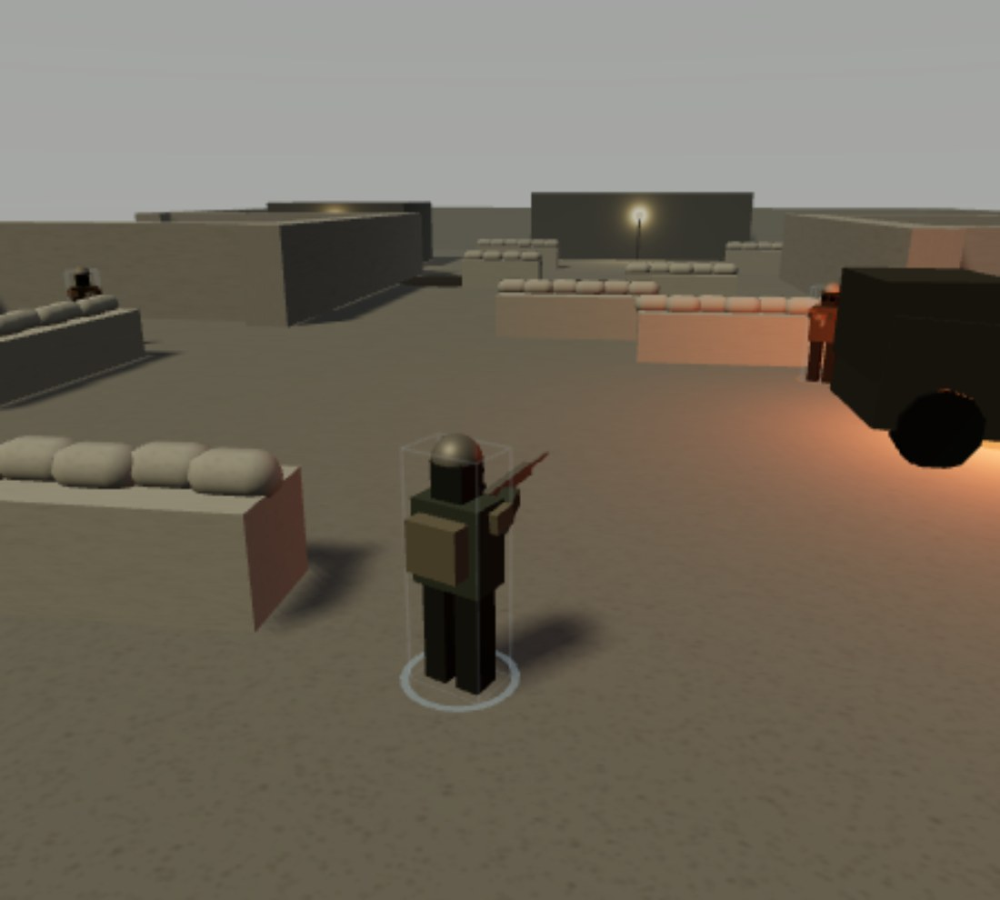
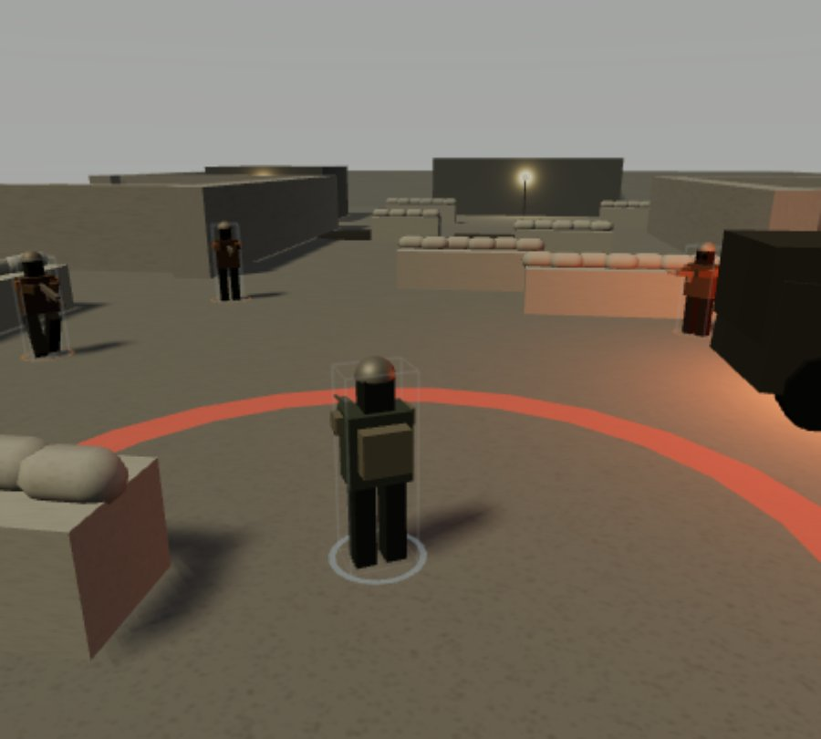
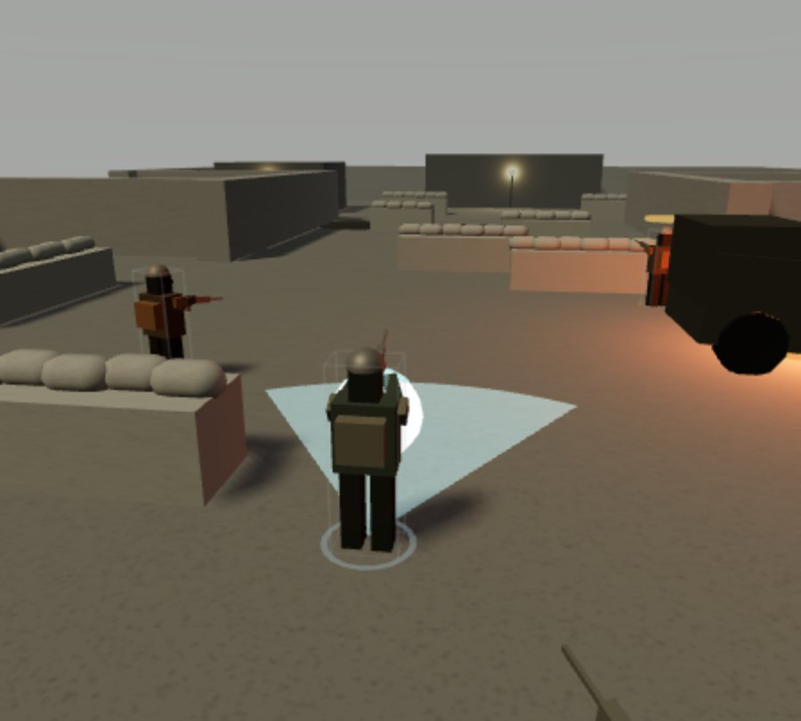
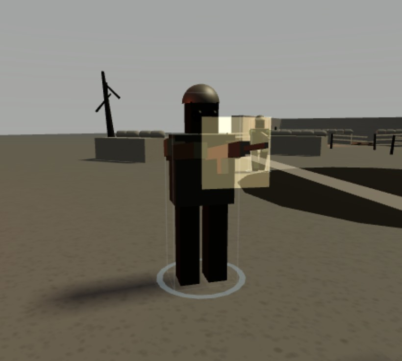

# Ashen Front — vertical slice

A playable browser prototype of the *Ashen Front* concept: a third-person war RPG
on a fractured continent, built as one complete loop rather than a wide, shallow demo.

**Mission: "Cut the Wire" — Vaunt Salient.** You are a Kaldreich deserter the Free
Marches Coalition has not made its mind up about. Cross the wire, clear a trench
junction, and end an artillery battery firing on the Coalition line. There is a
civilian shelter eleven metres from the battery wall.

## Play the demo

**[alexstaaa.github.io/Ashen-Front-game-](https://alexstaaa.github.io/Ashen-Front-game-/)**

Published from `main` by GitHub Actions, which runs the full test suite before it
deploys. Click the viewport once to capture the mouse.

| | |
| --- | --- |
|  |  |
| Cover-based gunplay at the junction. The ring under your feet is the cover state; the burning truck is a motivated light source. | The grenadier exists to make cover temporary — the ring is the authored blast radius, and moving is the only answer. |
|  |  |
| The Emberlash relic ignores earthworks. The blue sector is the exact contact shape the simulation resolved. | Actors are deliberate procedural placeholders, drawn with a visible cage so they cannot be mistaken for final art. |

## Running it locally

```bash
npm install
npm run dev      # http://127.0.0.1:5183
npm test         # 73 headless simulation tests
npm run build
```

| Key | Action |
| --- | --- |
| `W A S D` | Move (camera-relative) |
| Mouse | Look / aim |
| Left click | Fire |
| `R` | Reload |
| `Space` | Dive — brief invulnerability, breaks cover |
| `F` | Bayonet — heavy posture damage |
| `Q` | Emberlash relic — ignores cover, raises attunement |
| `Tab` | Lock on / release |
| `1` `2` `3` | Squad order: hold / advance / focus |
| `E` | Interact — hold to revive a downed squadmate |
| `Shift` | Sprint |
| `Esc` | Pause · `F3` Debug overlay |

## What the slice actually demonstrates

Each of the concept's five pillars is present as a working system, not a mock-up.

**Tactical third-person combat.** Every verb — player, ally and enemy alike — is a
record in one authored move table (`src/content/moves.js`) with explicit startup,
active windows, recovery, cooldown and contact shape. Outcomes come from geometric
contact tests against that data, never from animation. Cover is a real query: a low
sandbag line between you and a shooter cuts hit chance to 45% and damage to 75%, and
the same function answers for the AI, the bullet and the HUD.

**Squad command.** Cpl. Vela Ruhn carries morale and loyalty as separate stats.
Morale is a combat stat — it scales her accuracy and how hard she hugs cover. Loyalty
is narrative. Below 26 morale she refuses the Advance order outright. She goes down
rather than dying, and bleeds out over 22 seconds unless you revive her.

**Branching faction reputation.** Three factions on a signed −100..100 scale, with an
authored spillover matrix: gaining standing with one costs you standing with its
rivals. You cannot end the mission liked by everyone.

**Dynamic warfront.** Territory taken moves a 0–100 control figure for the salient,
shown as an animated frontline on the debrief.

**Moral choice.** The battery decision has three options and no dominant one:
call the barrage (fast, total, kills the shelter), breach on foot (a real third
encounter, saves the shelter, costs you most of a magazine), or signal the Ashborn
(spends a relic charge; the civilians survive and are *changed*). Firing the relic
during normal play also raises an attunement counter the Ashborn are reading.

## Architecture

The simulation is plain JavaScript with no Three.js import anywhere under `src/sim`
or `src/content`. That is what lets the whole game run headless in tests, and what
keeps rendering strictly downstream.

```
src/
  content/     authored, immutable data — moves, actors, relics, level, mission
  core/        rng, event bus, 2D plane maths, fixed-timestep loop, input, save
  sim/         world, cover, combat, ai, squad, player, mission, consequences
  render/      scene, actor views, camera, vfx, hud, screens
  debug/       URL-addressable review fixtures
tests/         73 tests, all headless
```

**One-way data flow.** Input → simulation → resolved events → presentation.
Subscribers on the bus may not write simulation state.

**One clock.** A 60 Hz fixed timestep drives combat timing, AI dwell times,
cooldowns and VFX lifetimes. No system carries its own clock.

**One gameplay plane.** All collision, navigation, spawns and zones live at `y = 0`,
and the simulation is 2D by construction. Trenches read vertically as parapets
*built up* rather than ground dug down, so the fiction works without ever changing
walkable elevation. Content validation rejects any authored elevation data.

**Content validation at boot.** `src/content/validate.js` rejects duplicate IDs,
dangling references, active windows that open before startup ends, anchors buried
inside geometry, unexplained lights and — importantly — any critical-path leg that
level geometry has blocked.

**Source-to-light inventory.** Every local light is declared with the visible emitter
that produces it and is created as a child of that emitter, so disabling the prop
disables the light. There is no code path that adds a floating light.

## Assets

All actors are **deliberate procedural placeholders**, built in-engine and drawn with
a visible wireframe cage and a team ring so they cannot be mistaken for final art.
They implement the full presentation contract in `src/content/actors.js` — footprint,
height, ground pivot, `+Z` forward axis, named sockets — so swapping in a real mesh is
a matter of matching that contract, not editing gameplay code. The console logs the
fallback once on boot.

## Review states

Any awkward moment is reachable directly from a URL, with `?seed=` for a
byte-identical run:

| URL | State |
| --- | --- |
| `?fixture=junction` | Straight into the junction fight |
| `?fixture=grenadier` | One grenadier, close, already hunting you |
| `?fixture=lowhp` | Junction at 22 hp, one magazine, Vela's morale too low to advance |
| `?fixture=empty` | Out of ammunition, relic charged, enemies inbound |
| `?fixture=downed` | Vela down and bleeding out beside you |
| `?fixture=choice` | At the bunker with the decision armed |
| `?fixture=breach` | The decision already taken the hard way |

Add `&debug=1` for the overlay (frame time, draw calls, per-enemy AI state),
`&reduced=1` for reduced motion, `&quality=low` for the low tier.
Fixture runs start from a clean run state and never overwrite your save.

`window.ashen` exposes the same handles for console poking, plus `tick()`,
`tickSim()` and `setInput()` for scripted browser QA.

## Testing

`npm test` runs 73 headless tests: move-timing boundaries, per-window contact
deduplication, cover geometry and its effect on hit chance and damage, dive
invulnerability windows, posture breaks and stagger interrupts, grenade fuse and
blast falloff, AI state transitions, the committed-attacker cap, leash limits,
noise investigation, control mapping, encounter wave gating, the approach gate, all
three choice outcomes, reputation spillover, save/continue, and seed determinism
across a full scripted playthrough.

Two of these exist because they caught real bugs during the build: a critical-path
traversal test (level geometry once blocked the route through the wire) and a facing
test (every character rendered backwards until the `+Z` contract was applied on both
sides).

## Known limits of the slice

- One mission, one level, one squadmate, two enemy archetypes.
- Enemy movement is local steering with box avoidance, not a navmesh. It suits this
  arena; a larger level would need real pathfinding.
- No audio implementation — the hooks are declared in the move data (`fx.sound`) and
  emitted as events, but nothing plays them yet.
- Touch controls are not implemented; the HUD is responsive but the slice is
  keyboard-and-mouse.
- Saves cover run state (reputation, frontline, squad, choices), not mid-mission
  position.
